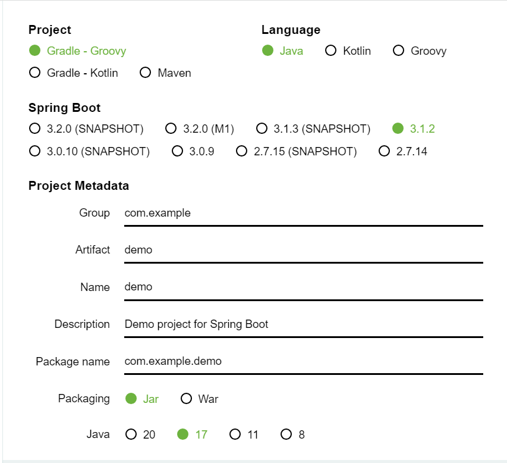

> **이 장에서 배울 내용**
>
> * SpringBoot 프로젝트 설정

<!--more-->

* this unordered seed list will be replaced by the toc
{:toc}

# Spring initializr

먼저 Spring 프로젝트를 시작하기에 앞서 Spring Boot 에서 제공하는 툴인 [https://start.spring.io/](https://start.spring.io/)에서 원하는 라이브러리를 선택하고 하단의 Generate 버튼을 눌러서 생성한다.

* Project: 생성할 프로젝트의 build tool을 선택한다. Build Tool에 대한 이해가 필요하다면 [전 게시글](https://hye807n.github.io/studylog/gradle,maven.html)을 보자. ~~(나는 gradle을 선택했다.)~~
